# Domain 1: SDLC Automation

> Flow and sequence diagrams covering CodePipeline, CodeBuild, CodeDeploy, blue-green deployments, event-driven automation, and related services.

---

## 1. CI/CD Pipeline Flow

**Key Services**: CodePipeline + CodeBuild + CodeDeploy integration, artifact handling.

```mermaid
flowchart LR
    GitHub[GitHub Repository] -->|webhook| GH_Actions[GitHub Actions]
    GH_Actions -->|docker build| Docker[Docker Build]
    Docker -->|push| ECR[ECR / LocalStack S3]
    ECR -->|trigger| CodePipeline[AWS CodePipeline]
    CodePipeline -->|source artifact| CodeBuild[AWS CodeBuild]
    CodeBuild -->|buildspec.yml| Test[Run Tests + Trivy Security]
    Test -->|pass| CodeDeploy[AWS CodeDeploy]
    CodeDeploy -->|deploy| EC2[EC2 Instance]
    EC2 -->|blue-green| ALB[ALB / NGINX]
```

---

## 2. Blue-Green Deployment Sequence

**Key Services**: Traffic shifting, rollback strategy, CodeDeploy deployment groups.

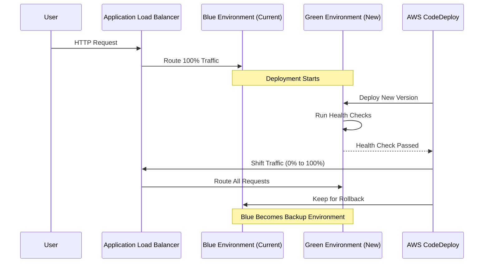

---

## 3. Event-Driven Automation Flow

**Key Services**: CloudWatch + EventBridge + Lambda + SSM for auto-remediation.

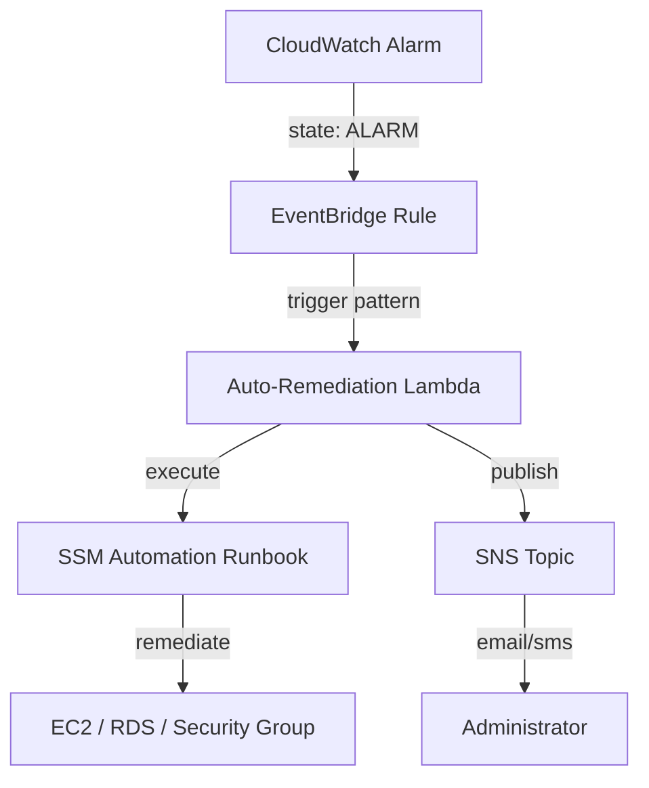

---

## 4. SNS + SQS Fan-out with Dead Letter Queue

**Key Services**: Fan-out pattern, DLQ configuration, Lambda event source mapping.

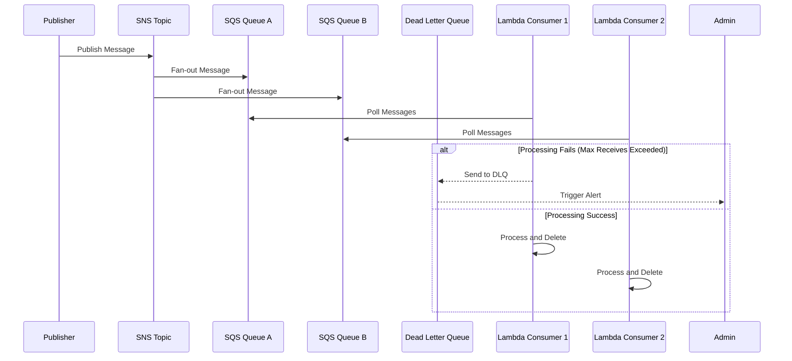

---

## 5. CloudFormation Nested Stacks Architecture

**Key Services**: Stack dependencies, exports, change sets, drift detection.

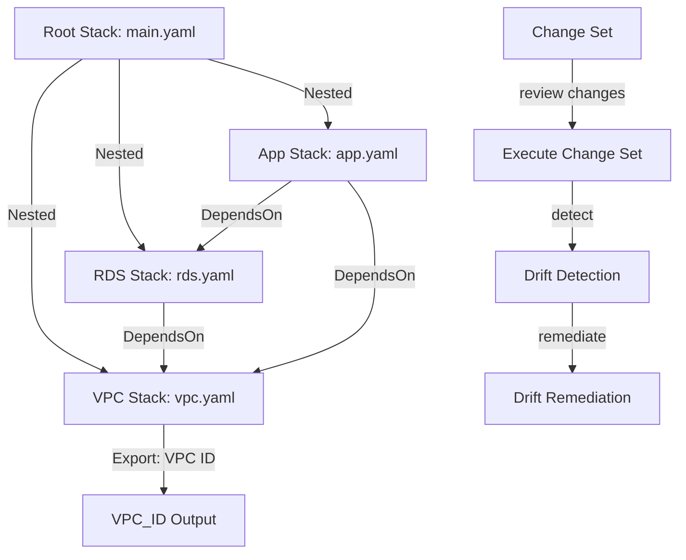

---

## 6. CodePipeline Multi-Stage with Manual Approval

**Key Services**: Manual approval action, stage transitions, pipeline execution modes.

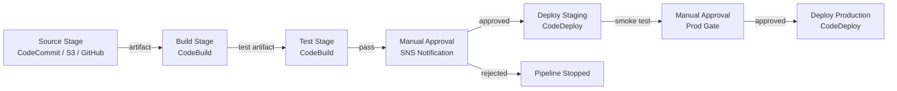

---

## 7. CodeDeploy Deployment Strategies

**Key Services**: AllAtOnce, HalfAtATime, OneAtATime, canary vs linear traffic shifting.

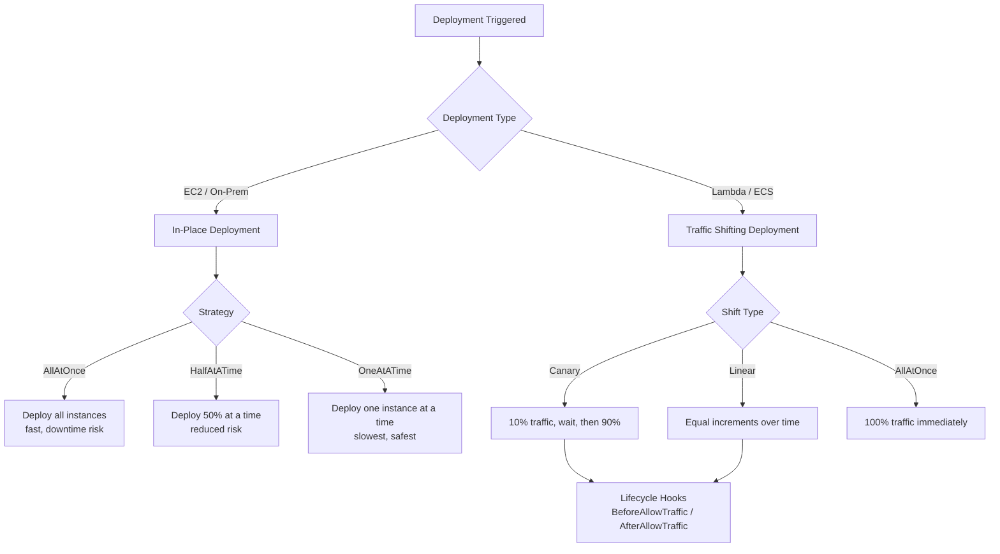

---

## 8. CodeBuild buildspec.yml Execution Flow

**Key Services**: Build phases, environment variables, artifact upload, cache.

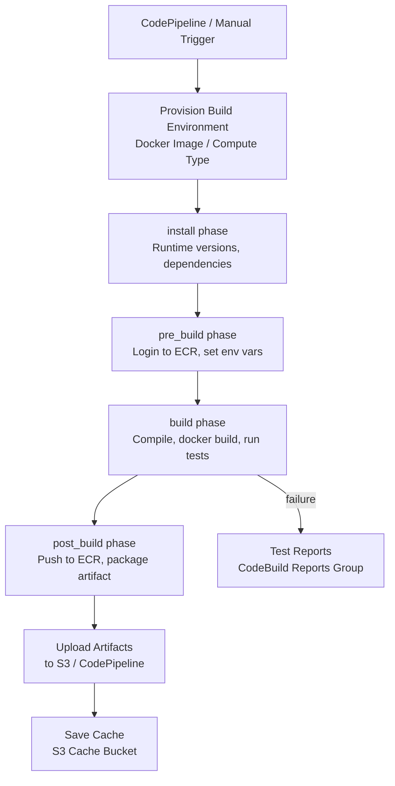

---

## 9. Elastic Beanstalk Deployment Policies

**Key Services**: Deployment policies, rolling updates, immutable vs blue-green.

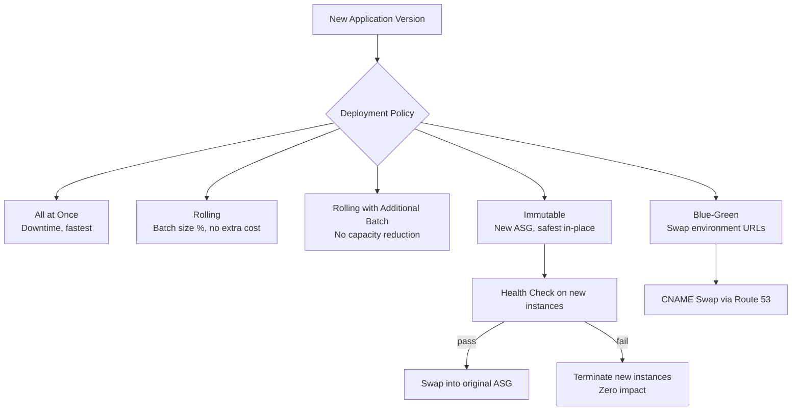

---

## 10. CodeCommit Branch Protection and PR Flow

**Key Services**: Approval rule templates, triggers, notifications.

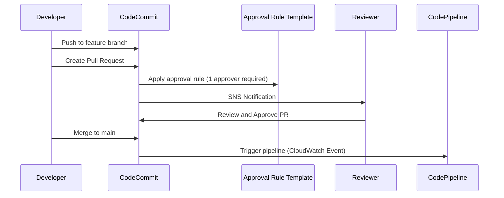

---

## 11. Artifact Flow through CodePipeline

**Key Services**: S3 artifact bucket, encryption, cross-account pipeline.

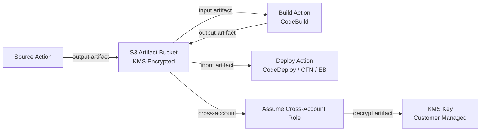

---

## 12. Systems Manager Patch Manager Flow

**Key Services**: Patch baselines, maintenance windows, compliance reporting.

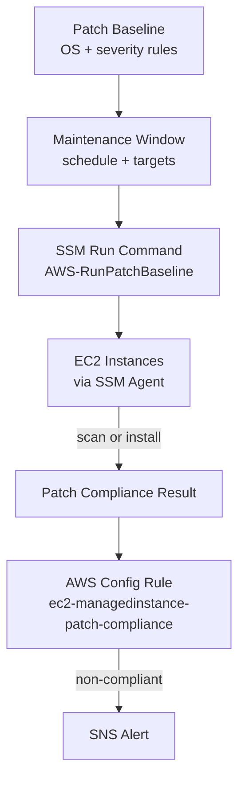
