main 2: Configuration Management and IaC

> Flow and sequence diagrams covering CloudFormation, CDK, SSM, OpsWorks, and related IaC and configuration management services.

---

## 1. CloudFormation Stack Lifecycle

**Services Involved**: CloudFormation, S3, IAM, SNS

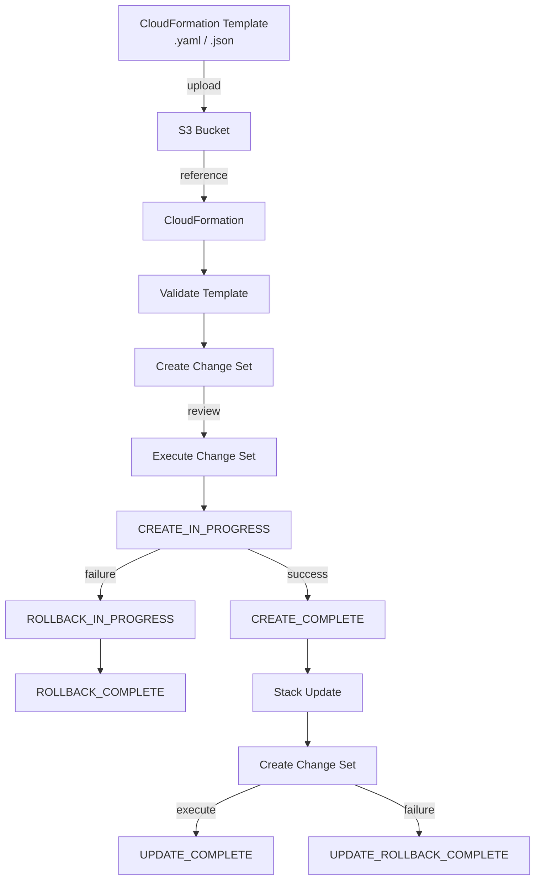

---

## 2. CloudFormation Cross-Stack References

**Services Involved**: CloudFormation, SSM Parameter Store, S3

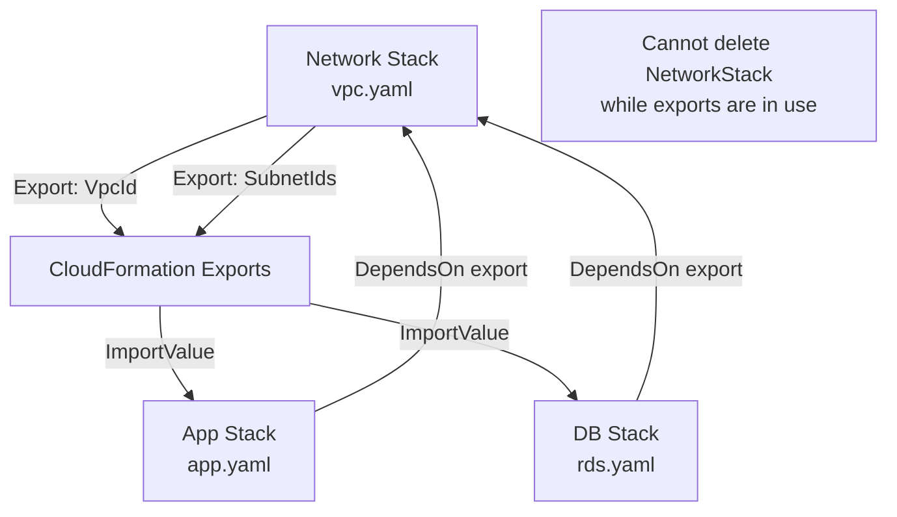

---

## 3. CloudFormation StackSets — Multi-Account / Multi-Region

**Services Involved**: CloudFormation StackSets, AWS Organizations, IAM

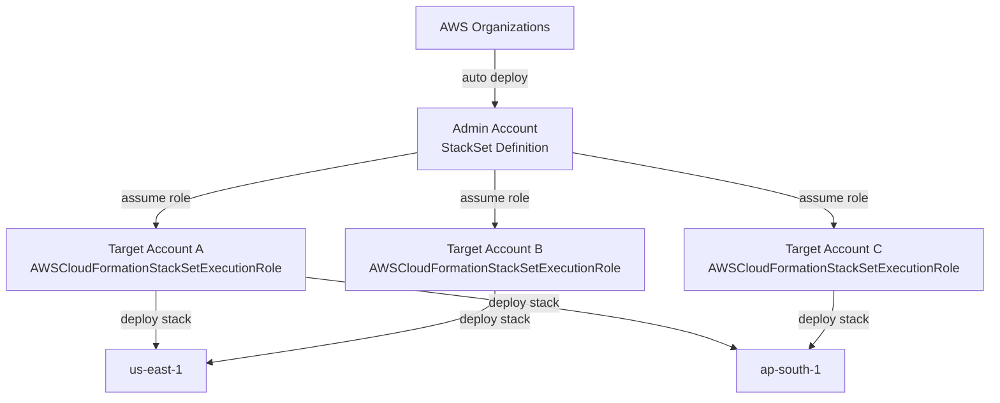

---

## 4. CloudFormation Custom Resource Flow

**Services Involved**: CloudFormation, Lambda, S3 (presigned URL), SNS

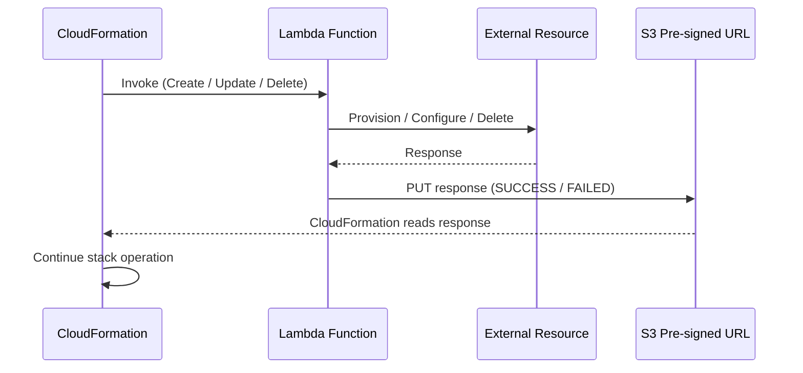

---

## 5. AWS CDK Synthesis and Deploy Flow

**Services Involved**: AWS CDK, CloudFormation, S3, ECR, IAM (CDK Toolkit)

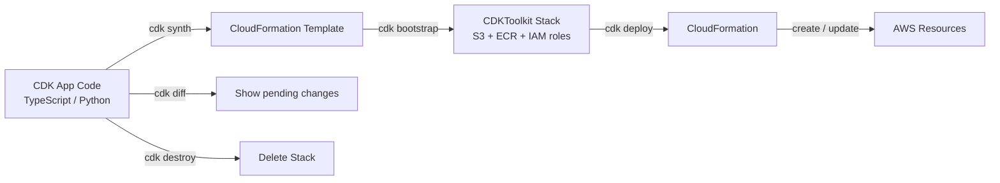

---

## 6. SSM Parameter Store vs Secrets Manager

**Services Involved**: SSM Parameter Store, Secrets Manager, KMS, Lambda, EC2

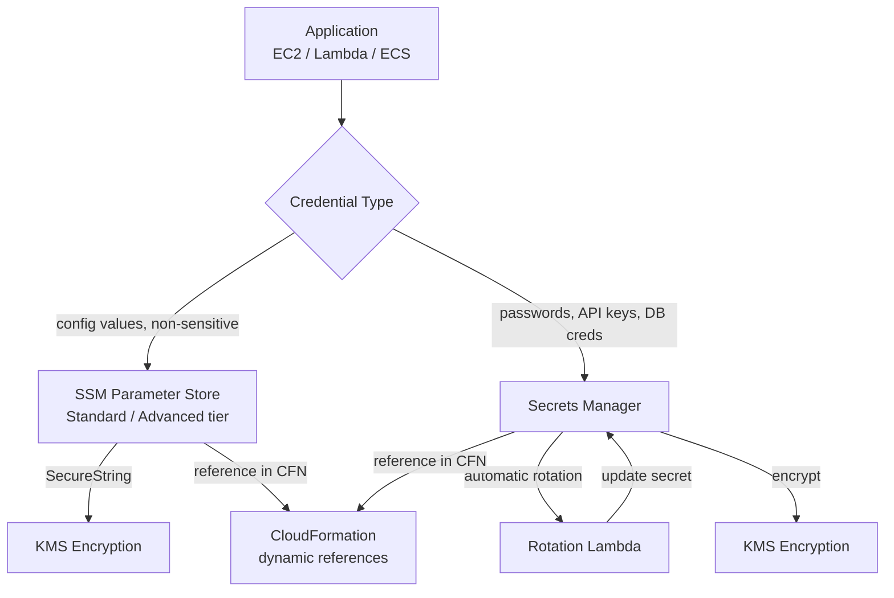

---

## 7. SSM State Manager — Configuration Compliance Flow

**Services Involved**: SSM State Manager, SSM Documents, EC2, S3, CloudWatch

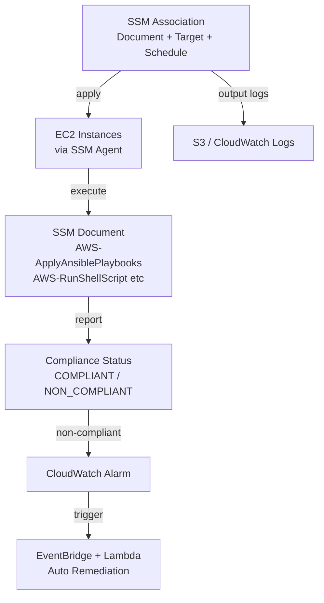

---

## 8. SSM Automation Runbook Flow

**Services Involved**: SSM Automation, IAM, EC2, Lambda, CloudWatch

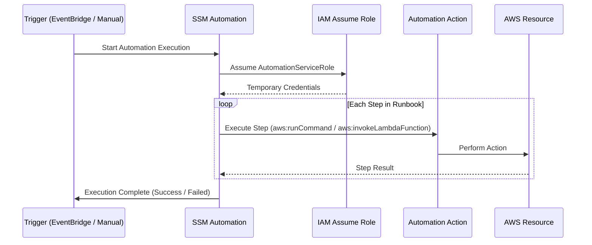

---

## 9. OpsWorks Stacks Layer Model

**Services Involved**: OpsWorks Stacks, EC2, RDS, ELB, Chef

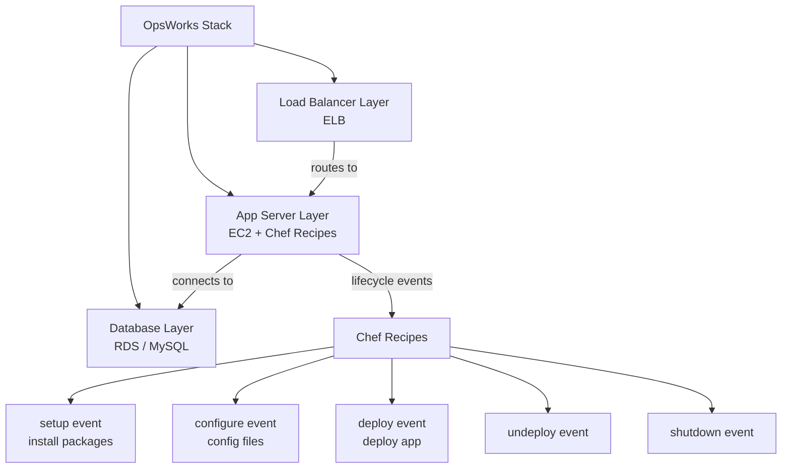

---

## 10. Ansible vs SSM Run Command — Push vs Pull

**Services Involved**: Ansible, SSM Run Command, EC2, S3

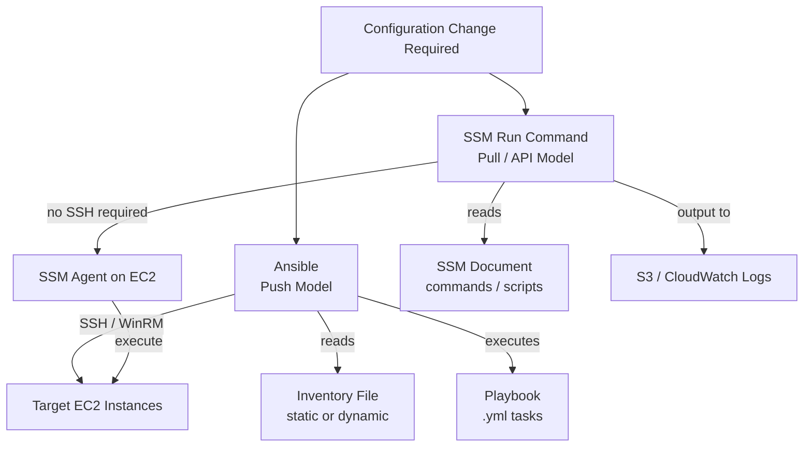

---

## 11. CloudFormation Drift Detection Flow

**Services Involved**: CloudFormation, AWS Config, SNS, Lambda

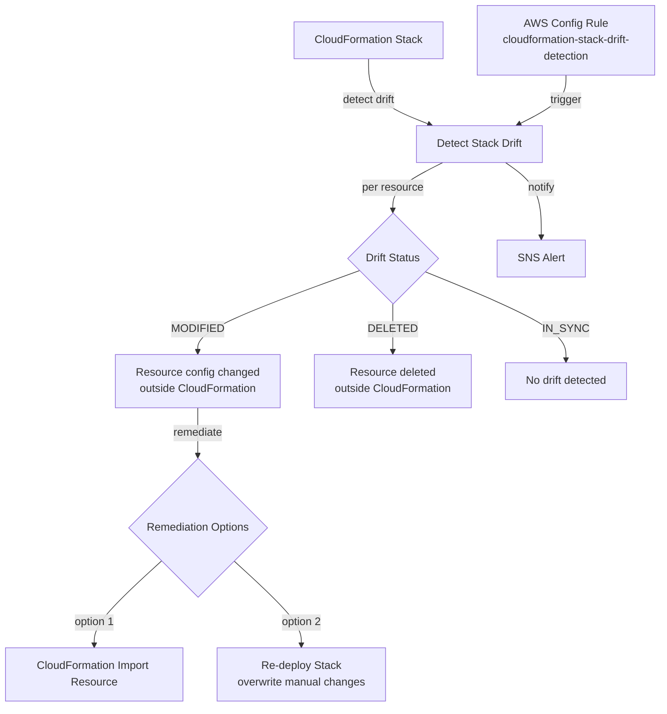

---

## 12. Service Catalog — Governed IaC Provisioning

**Services Involved**: Service Catalog, CloudFormation, IAM, S3

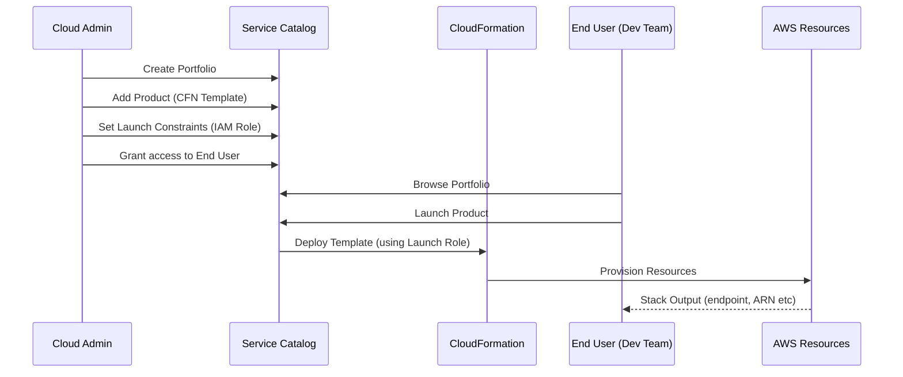
