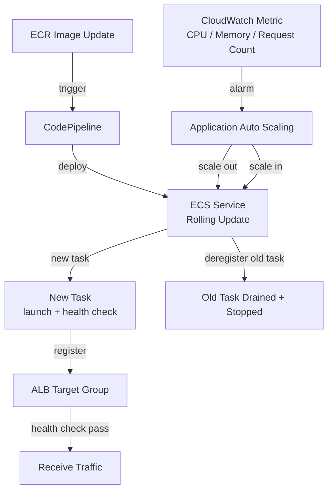
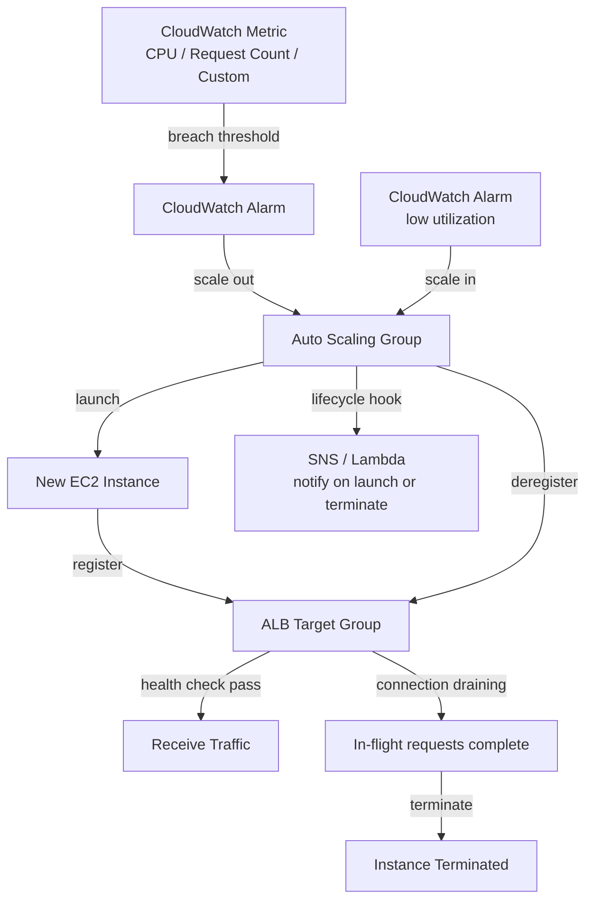
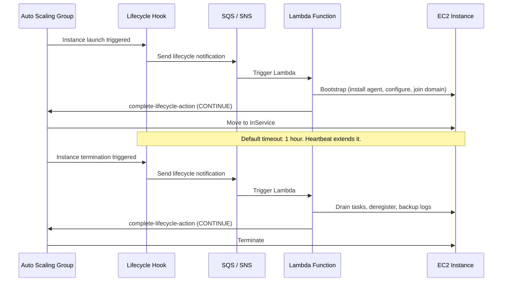
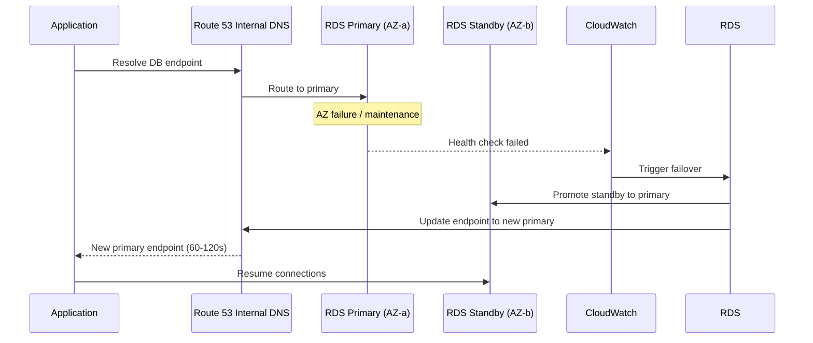
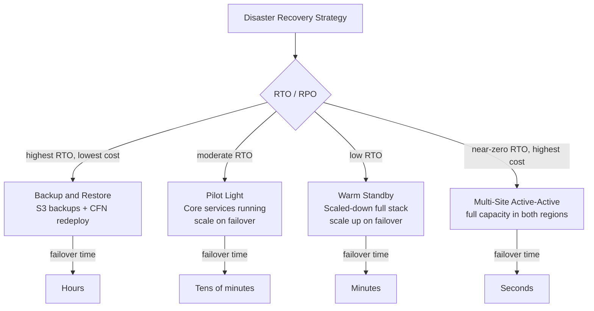
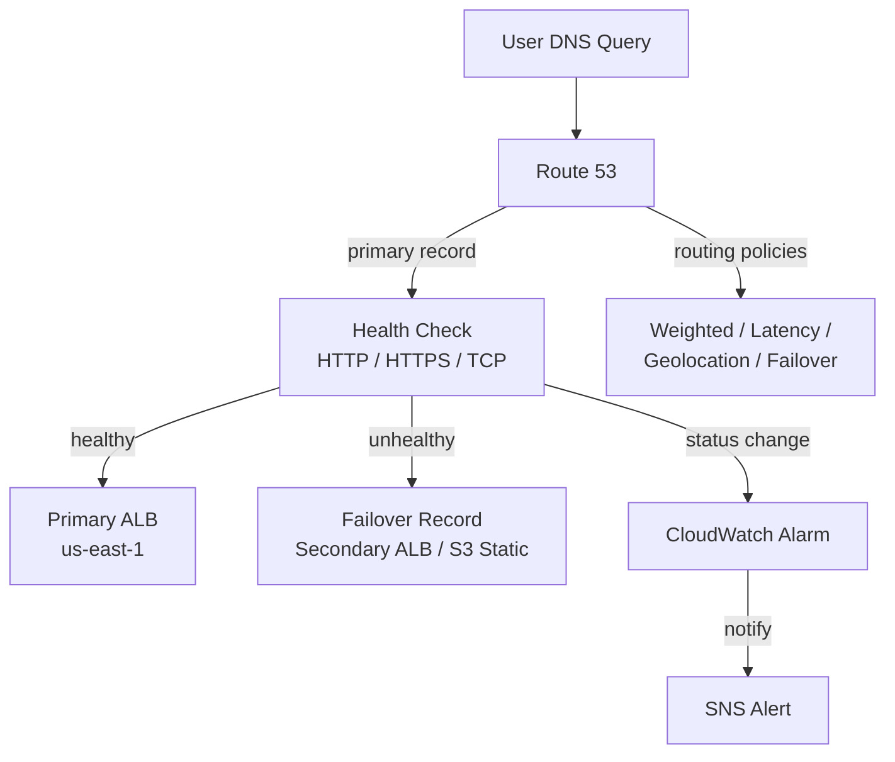

# Domain 3: Resilient Cloud Solutions

> Flow and sequence diagrams covering high availability, fault tolerance, disaster recovery, auto scaling, and resilience patterns.

---

## 1. ECS Service Auto Scaling and Rolling Update

**Services Involved**: ECS, ALB, CloudWatch, Application Auto Scaling, ECR

## 2. Auto Scaling Group — Scale Out and Scale In Flow

**Services Involved**: EC2 Auto Scaling, CloudWatch, ALB, SNS

---

## 3. ASG Lifecycle Hooks

**Services Involved**: EC2 Auto Scaling, SQS, Lambda, SNS, SSM

---

## 4. RDS Multi-AZ Failover Sequence

**Services Involved**: RDS, Route 53 (internal DNS), EC2, CloudWatch

---

## 5. Disaster Recovery Strategies

**Services Involved**: Route 53, RDS, S3, EC2, CloudFormation, Pilot Light / Warm Standby

---

## 6. Route 53 Failover Routing with Health Checks

**Services Involved**: Route 53, ALB, CloudWatch, SNS

---

