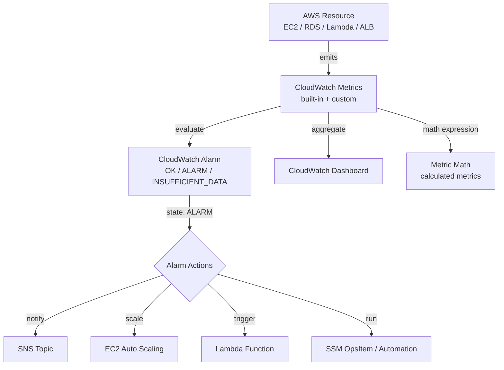
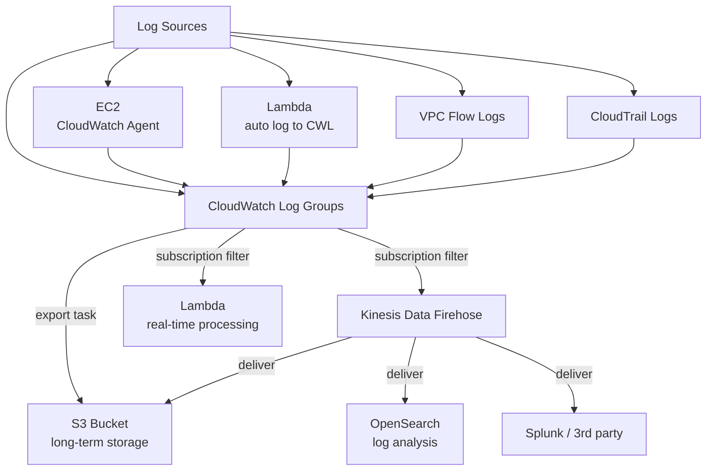
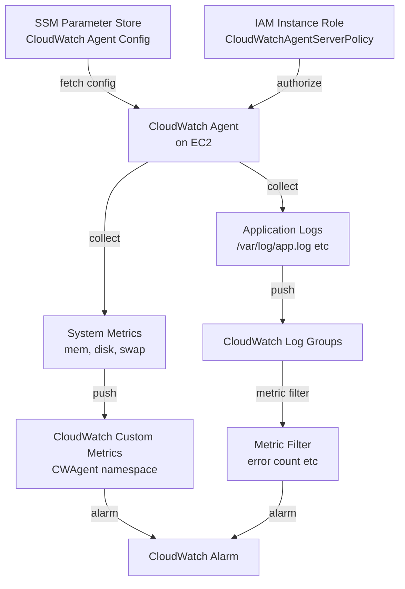

main 4: Monitoring and Logging

> Flow and sequence diagrams covering CloudWatch

---

## 1. CloudWatch Metrics, Alarms, and Actions

**Services Involved**: CloudWatch, SNS, EC2 Auto Scaling, Lambda, Systems Manager

---

## 2. CloudWatch Logs — Ingestion and Processing Pipeline

**Services Involved**: CloudWatch Logs, Kinesis Data Firehose, S3, Lambda, OpenSearch

---

## 3. CloudWatch Agent — EC2 Custom Metrics and Logs

**Services Involved**: CloudWatch Agent, EC2, SSM Parameter Store, IAM, CloudWatch

---
