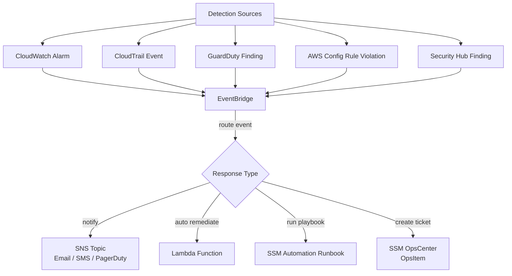
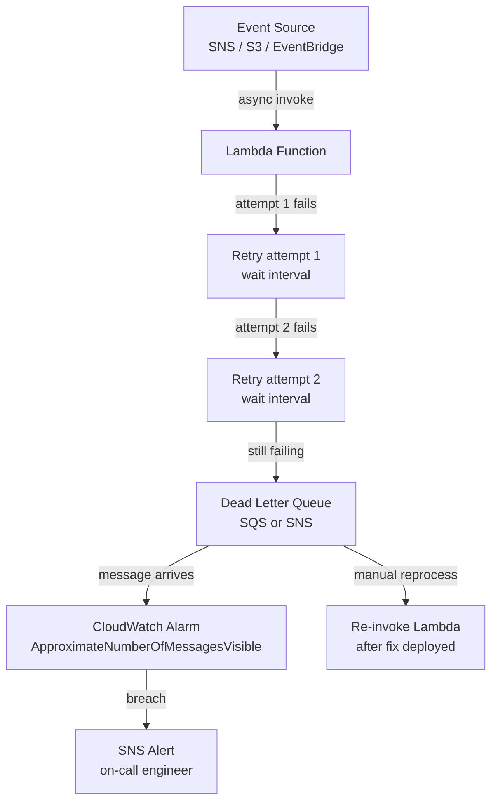
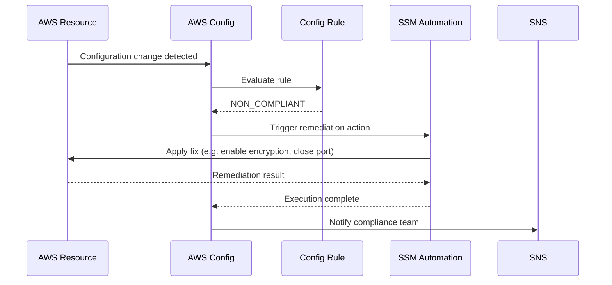
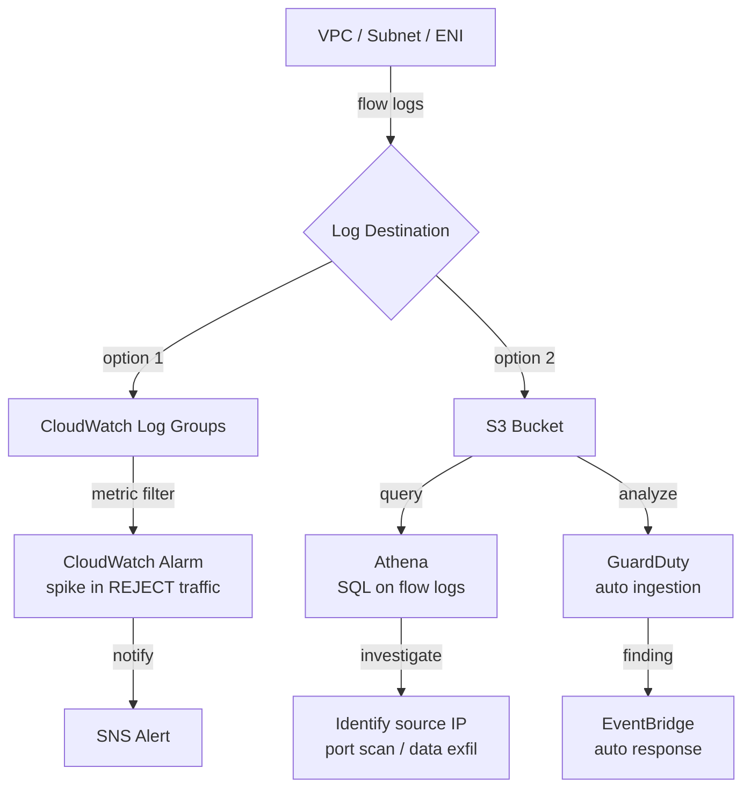

# Domain 5: Incident and Event Response

> Flow and sequence diagrams covering incident detection, automated remediation and event-driven response patterns.

---

## 1. Incident Detection and Response — High Level Flow

**Services Involved**: CloudWatch, EventBridge, SNS, Lambda, SSM OpsCenter, PagerDuty

## 2. Lambda Dead Letter Queue — Failed Event Handling

**Services Involved**: Lambda, SQS, SNS, CloudWatch, EventBridge

---

## 3. Config Rule — Non-Compliant Resource Auto Remediation

**Services Involved**: AWS Config, SSM Automation, EventBridge, Lambda, SNS

---

## 4. VPC Flow Logs — Network Incident Investigation

**Services Involved**: VPC Flow Logs, CloudWatch Logs, Athena, S3, GuardDuty

