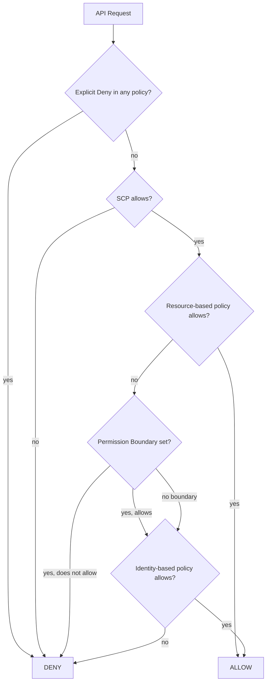
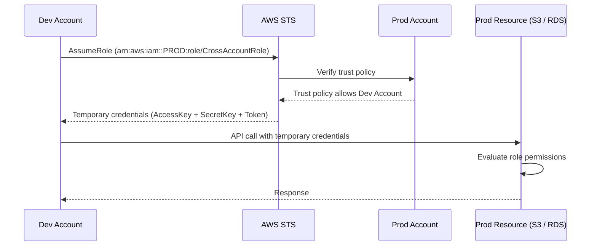
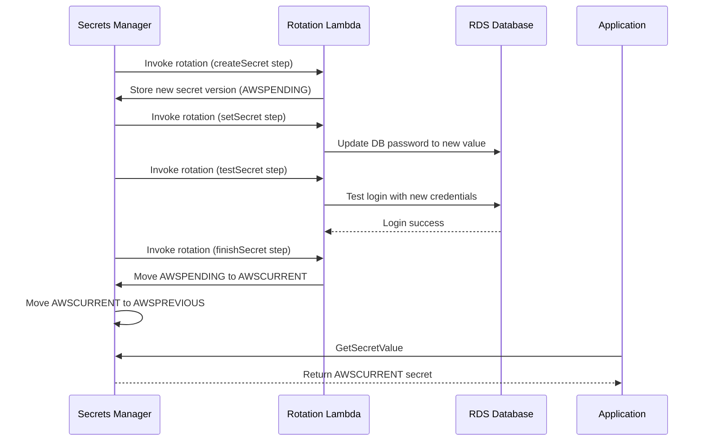

# Domain 6: Security and Compliance

> Flow and sequence diagrams covering IAM, KMS, Secrets Manager

---

## 1. IAM Policy Evaluation Logic

**Services Involved**: IAM, SCP, Resource Policy, Permission Boundary, Session Policy

---

## 2. IAM Roles — Cross-Account Access Flow

**Services Involved**: IAM, STS, S3, CloudTrail

---

## 3. Secrets Manager — Secret Rotation Flow

**Services Involved**: Secrets Manager, Lambda, RDS, KMS, CloudTrail

---

